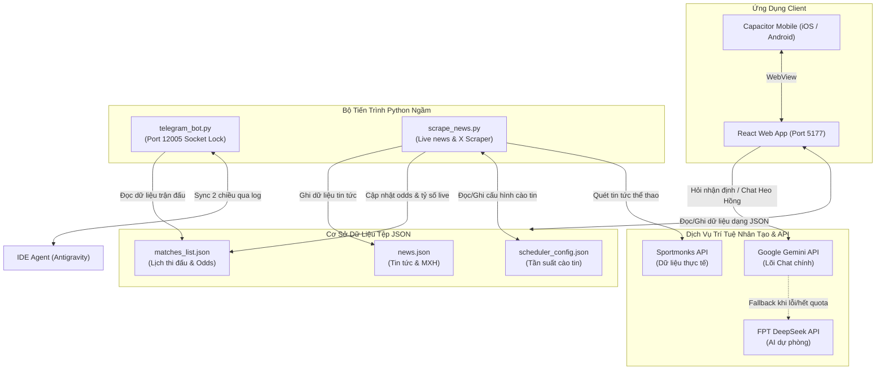

# 🏆 World Cup 2026 — Mobile & AI Platform

[](https://react.dev)
[](https://vite.dev)
[](https://capacitorjs.com)
[](https://python.org)
[](https://deepmind.google/technologies/gemini/)

World Cup 2026 AI & Mobile Platform là một ứng dụng di động đa vũ trụ đồng hành toàn diện cùng giải vô địch bóng đá thế giới World Cup 2026. Dự án kết hợp giao diện Bento Glassmorphic thời thượng, thuật toán AI dự đoán tỷ số Dixon-Coles Poisson, mô hình chat Tiên Tri Heo Hồng tích hợp cơ chế Dual-Engine Fallback, đồng bộ Telegram Bot thời gian thực và hệ thống tự động cào tin tức thể thao trực tuyến.

---

## 🗺️ Kiến Trúc Hệ Thống (System Architecture)

Dự án được thiết kế theo mô hình phi tập trung với sự kết hợp chặt chẽ giữa Frontend di động (React + Capacitor) và các script tự động hóa nền (Python Automation Engine).



---

## ✨ Các Tính Năng Bản Cốt Lõi (Core Features)

### 1. 🤖 Thuật Toán Tiên Tri Dixon-Coles & Poisson
* **Bivariate Poisson Distribution**: Tính toán xác suất ghi bàn của đội nhà và đội khách độc lập, dựa trên chỉ số năng lực tấn công (Attack Strength) và phòng thủ (Defense Strength) của từng đội.
* **Dự toán tỷ số 5x5**: Xuất bản bản đồ nhiệt phân phối xác suất các tỷ số cụ thể (0-0, 1-0, 2-1...) được trực quan hóa bằng độ đậm nhạt của màu sắc (Pink heat-intensity).
* **Hiệu chỉnh Dixon-Coles**: Áp dụng hệ số điều chỉnh tỷ lệ hòa (Draw correction parameter $\rho$) cho các trận đấu có xu hướng ít bàn thắng (0-0, 1-0, 0-1, 1-1) giúp giảm thiểu sai số vốn có của mô hình Poisson truyền thống.
* **Tự động cân bằng ELO**: Điều chỉnh sức mạnh các đội dựa trên chuỗi phong độ 5 trận gần nhất và cộng thêm ELO ảo lợi thế sân nhà co-host (USA, Canada, Mexico).

### 2. 🐷 Trợ Lý Tiên Tri Heo Hồng AI (Dual-Engine Fallback)
* **Giao diện tương tác mượt mà**: Hộp trò chuyện thiết kế theo phong cách Glassmorphism nổi, tích hợp hiệu ứng chuyển động và bong bóng chat dễ thương.
* **Dual-Engine Smart Fallback**: Hệ thống sử dụng mô hình **Google Gemini 2.5/Pro** làm lõi xử lý chính. Nếu gặp sự cố quá tải, hết quota API hoặc lỗi mạng, hệ thống tự động chuyển hướng yêu cầu (fallback) sang **FPT DeepSeek API** để đảm bảo phản hồi tức thì cho người dùng.
* **Gợi ý câu hỏi nhanh (Suggestion Chips)**: Đưa ra các gợi ý câu hỏi nhận định bảng đấu, khả năng đi tiếp của Đội tuyển Việt Nam và soi kèo nhanh các trận đấu.

### 3. 💬 Đồng Bộ Bot Telegram Hai Chiều (Real-time Sync)
* **Thông tin Bot**: `@drthanhto_bot` (Token: `7660859485:AAFiyYQF7sh3nSp0dkYNFMo8-31LPyj7RRA`).
* **Đồng bộ hội thoại**: Người dùng có thể trò chuyện với IDE Agent từ xa thông qua ứng dụng Telegram. Bot sẽ ghi nhận tin nhắn, chuyển tiếp vào IDE và phản hồi ngược lại Telegram qua tệp tin log của Agent.
* **Cơ chế Khóa Cổng (Socket Lock)**: Nhằm ngăn chặn việc mở nhiều tiến trình bot gây trùng lặp tin nhắn phản hồi, script `telegram_bot.py` sẽ mở và khóa cổng cục bộ `12005`. Chỉ khi cổng này trống, script mới được phép chạy.

### 4. 📱 Tối Ưu Hóa Trải Nghiệm Di Động (Notch & Safe Areas)
* **Bố cục Bento Grid responsive**: Tự động điều chỉnh bố cục linh hoạt khi chạy trên Web di động, Tablet hay các ứng dụng Android/iOS đóng gói.
* **Hỗ trợ Tai thỏ (Notch Display)**: Sử dụng các biến môi trường CSS `safe-area-inset-top` để đệm thanh Header tránh bị che bởi tai thỏ/đục lỗ, và `safe-area-inset-bottom` giúp Tab bar không bị đè bởi vạch điều hướng của iOS/Android.
* **Nút cược nổi & Trượt cược (Bet Slip FAB & Sheet)**: Khi người dùng chọn kèo cược nhanh trên màn hình, một nút nổi (FAB) Heo Vàng sẽ tự động xuất hiện. Nhấp vào nút sẽ mở Bottom Sheet chứa phiếu cược vui để người dùng nhập tiền cược ngay lập tức.

### 5. 📰 Sports News & Social Media Live Scraper
* **Đồng bộ thời gian thực**: Cào tin liên quan đến hai đội bóng trước trận đấu 8 tiếng (10 phút một lần) và trong trận đấu (1 phút một lần). Dữ liệu được lưu trữ thật (không lưu tạm), giữ lại trong vòng 7 ngày kể từ khi trận đấu kết thúc.
* **Bản tin mạng xã hội nóng**: Thu thập các đoạn video clip thực tế quay bằng điện thoại trên sân vận động từ X (Twitter) và bài nhận định của các BLV bóng đá Việt Nam nổi tiếng để người dùng cập nhật không khí trực tiếp sôi động.

---

## 🛠️ Hướng Dẫn Cài Đặt Chi Tiết (Detailed Setup)

### Yêu Cầu Hệ Thống (Prerequisites)
* **Node.js**: Phiên bản 18.x hoặc 20.x trở lên.
* **Python**: Phiên bản 3.10 hoặc 3.11 trở lên.
* Môi trường đầu cuối (Terminal/Command Prompt) hỗ trợ Git.

### 1. Cài đặt mã nguồn Frontend (React)
Mở terminal tại thư mục gốc của dự án và chạy:
```bash
npm install
```

### 2. Cài đặt môi trường Python cho Scripts ngầm
Cài đặt các gói phụ thuộc cần thiết cho bot Telegram, bộ phân tích RSS tin tức và kết nối API:
```bash
pip install python-telegram-bot feedparser requests
```
*(Nếu hệ thống của bạn yêu cầu môi trường ảo, hãy chạy `python -m venv venv` và kích hoạt trước khi cài đặt).*

### 3. Cấu hình các biến môi trường
Tạo tệp tin `.env` ở **thư mục gốc** dự án và sao chép cấu hình dưới đây:
```env
# API Key của Google Gemini
VITE_GEMINI_API_KEY=AIzaSy... (Điền key Gemini của bạn)

# API Key của FPT DeepSeek (Fallback AI)
VITE_DEEPSEEK_API_KEY=fpt-ds... (Điền key DeepSeek của bạn)

# API Key Sportmonks (Lấy dữ liệu tỷ số, odds thực tế)
VITE_SPORTMONKS_API_KEY=YOUR_SPORTMONKS_API_KEY
```

Đồng thời, tạo tệp tin `.env` hoặc cấu hình biến môi trường trong thư mục `scripts/` để chạy mã Python:
```env
TELEGRAM_BOT_TOKEN=7660859485:AAFiyYQF7sh3nSp0dkYNFMo8-31LPyj7RRA
```

---

## 🚀 Hướng Dẫn Khởi Chạy (Running Instructions)

Dự án World Cup 2026 hoạt động tối ưu nhất khi chạy đồng thời 3 thành phần sau:

### 1. Chạy Frontend Web App
Chạy máy chủ phát triển Vite trên máy của bạn (Port mặc định sẽ là `5177`):
```bash
npm run dev
```
Sau khi chạy thành công, truy cập ứng dụng thông qua liên kết: `http://localhost:5177`

### 2. Chạy Telegram Bot Đồng Bộ 2 Chiều
Khởi động kịch bản bot để điều khiển thông qua Telegram `@drthanhto_bot`:
* **Trên macOS / Linux**:
  ```bash
  python scripts/telegram_bot.py
  ```
* **Trên Windows**:
  ```cmd
  python scripts\telegram_bot.py
  ```

### 3. Chạy Tiến Trình Cào Tin Tức Ngầm (Scraper)
Khởi động kịch bản cào tin tức bóng đá và bài viết mạng xã hội:
* **Trên macOS / Linux**:
  ```bash
  python scripts/scrape_news.py
  ```
* **Trên Windows**:
  ```cmd
  python scripts\scrape_news.py
  ```

---

## 📱 Đóng Gói Ứng Dụng Di Động (Capacitor Mobile Workflow)

Ứng dụng sử dụng Capacitor để biên dịch sang mã native iOS & Android. Dưới đây là các lệnh bạn cần sử dụng khi phát triển giao diện di động:

### Bước 1: Biên dịch mã nguồn React
```bash
npm run build
```

### Bước 2: Đồng bộ tài nguyên biên dịch sang iOS/Android
```bash
npm run cap:sync
```

### Bước 3: Khởi chạy dự án trên thiết bị giả lập hoặc máy thật

* **Dành cho iOS (Yêu cầu macOS & Xcode)**:
  ```bash
  npm run cap:open-ios
  ```
  *Lệnh này sẽ tự động khởi động Xcode và tải dự án `ios/App`. Chọn thiết bị giả lập (Simulator) hoặc iPhone cắm cáp của bạn rồi bấm nút Play (Build).*

* **Dành cho Android (Yêu cầu Android Studio)**:
  ```bash
  npm run cap:open-android
  ```
  *Lệnh này sẽ mở Android Studio cùng dự án `android`. Chờ đồng bộ Gradle hoàn thành, chọn thiết bị máy ảo Android Emulator và bấm Run.*

---

## 📁 Cấu Trúc Thư Mục Dự Án (Project Structure)

```
WC2026/
├── android/                    # Mã nguồn Native Android (Dự án Gradle)
├── ios/                       # Mã nguồn Native iOS (Dự án Xcode)
├── public/                    # Thư mục chứa tài nguyên tĩnh của Web
│   └── data/                  # Cơ sở dữ liệu tệp tin JSON
│       ├── news.json          # DB Lưu trữ tin tức cào được (Giữ trong 7 ngày)
│       ├── matches_list.json  # DB Lưu trữ thông tin trận đấu, tỷ số, ELO & Odds cược
│       └── scheduler_config.json # Cấu hình trạng thái cào tin ngầm
├── scripts/                   # Bộ mã nguồn Python ngầm
│   ├── telegram_bot.py        # Sync 2 chiều Telegram Bot & Socket Lock Daemon
│   ├── scrape_news.py         # Crawler tin tức thể thao & RSS & Social clip
│   └── .telegram_sync.json    # Trạng thái đồng bộ với IDE Conversation
├── src/                       # Thư mục mã nguồn React
│   ├── components/            # Các khối Bento Grid
│   │   ├── MatchList.jsx      # Danh sách trận đấu, tỷ số ELO & odds cược
│   │   ├── MatchDetail.jsx    # Chi tiết trận, sa bàn chiến thuật dọc & Dixon-Coles Poisson
│   │   ├── Standings.jsx      # Bảng xếp hạng các bảng đấu WC2026
│   │   ├── OracleChat.jsx     # Giao diện chat với Heo Hồng (Gemini + DeepSeek)
│   │   └── BetSlip.jsx        # Phiếu cược ảo (Floating FAB & Sheet)
│   ├── services/              # Kết nối API & Xử lý mạng
│   │   ├── api.js             # Simulators & Polling
│   │   ├── gemini.js          # Kết nối Google Gemini API
│   │   ├── fptDeepseek.js     # Kết nối FPT DeepSeek API dự phòng
│   │   └── rss.js             # Parse dữ liệu tin tức RSS
│   ├── utils/                 # Các tiện ích bổ trợ
│   │   └── poisson.js         # Thuật toán phân phối Poisson & Dixon-Coles 5x5
│   ├── App.jsx                # Bộ điều phối trung tâm & Responsive layout (Mobile notch)
│   ├── main.jsx               # Entrypoint khởi tạo React
│   └── index.css              # Hệ thống phong cách Glassmorphism chính
├── capacitor.config.json      # File cấu hình Capacitor di động
└── package.json               # Cấu hình dự án NodeJS & Dependencies
```

---

## ⚙️ Xử Lý Sự Cố Thường Gặp (Troubleshooting)

### Lỗi 1: `OSError: [Errno 48] Address already in use` khi chạy Telegram Bot
* **Nguyên nhân**: Script `telegram_bot.py` đã được mở ở một terminal khác hoặc bị treo ngầm chiếm giữ Port `12005`.
* **Cách khắc phục**:
  1. Tìm tiến trình đang chiếm giữ cổng:
     * *macOS / Linux*: `lsof -i :12005`
     * *Windows*: `netstat -ano | findstr 12005`
  2. Kết thúc tiến trình bằng PID tìm được:
     * *macOS / Linux*: `kill -9 <PID>`
     * *Windows*: `taskkill /F /PID <PID>`
  3. Khởi chạy lại script bot.

### Lỗi 2: Trò chuyện Heo Hồng báo "AI Heo Hồng bận, vui lòng thử lại sau"
* **Nguyên nhân**: API Key của Gemini bị quá tải hạn mức hoặc lỗi kết nối đến máy chủ Google AI.
* **Cách khắc phục**:
  * Đảm bảo bạn đã cấu hình chính xác `VITE_DEEPSEEK_API_KEY` trong tệp `.env`. Ứng dụng sẽ tự động chuyển sang FPT DeepSeek làm động cơ dự phòng sau 1 lần thử lại thất bại để cuộc trò chuyện của bạn không bị ngắt quãng.

### Lỗi 3: Giao diện trên iPhone bị lệch hoặc lút dưới thanh điều hướng (Home Indicator)
* **Nguyên nhân**: Ứng dụng chạy trên trình duyệt web safari hoặc WebView chưa bật viewport-fit.
* **Cách khắc phục**:
  * Đảm bảo thẻ `<meta name="viewport" ...>` trong `index.html` của bạn có thuộc tính `viewport-fit=cover`.
  * Các class chính như `.app-container`, `.navbar`, `.tab-bar` cần sử dụng các thuộc tính CSS `padding-bottom: env(safe-area-inset-bottom)` để tự động co giãn.

---

## ⚖️ Khuyến Cáo Pháp Lý (Disclaimer)
*Hệ thống cược vui sử dụng **xu Heo Vàng (ảo)** nhằm mục đích giải trí và soi kèo bóng đá lành mạnh bằng thuật toán Poisson. Ứng dụng hoàn toàn không hỗ trợ giao dịch, nạp/rút tiền thật dưới mọi hình thức.*

Chúc bạn có những trải nghiệm tuyệt vời cùng mùa giải World Cup 2026 và Tiên Tri Heo Hồng! 🐷⚽🏆
